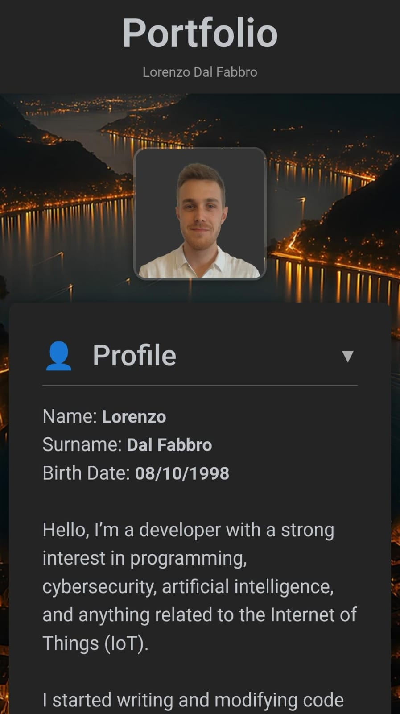

# Portfolio

This repository contains the source code of my personal **portfolio website**.  
It automatically generates **project cards** from a list of GitHub repositories, showing each project's title, description, and preview image (taken from the README).

---

## Preview

---

## Hosting
You can deploy the portfolio on any standard web server, such as:
- **Nginx**
- **Apache2**
- Or even use **GitHub Pages**, **Vercel**, or **Netlify**
